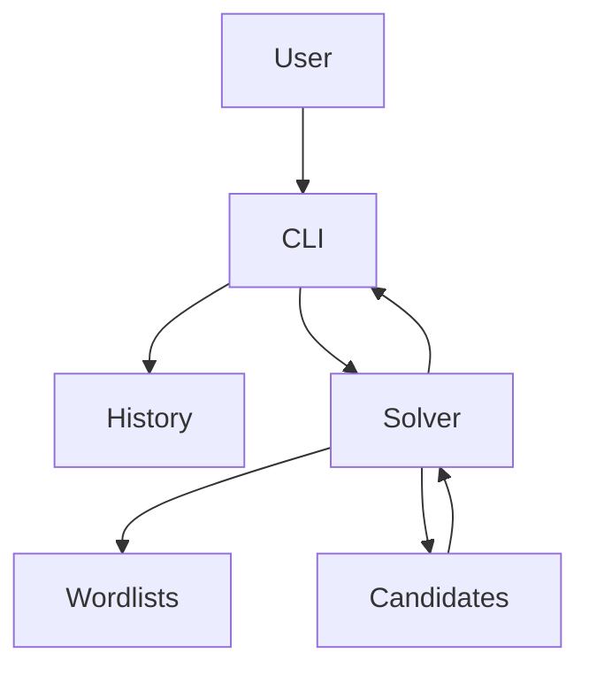

# MVP NodeJS Wordle Solver (CLI)

## What we’re building (MVP)

A **terminal (CLI) Wordle assistant** that:

- Takes **guess + feedback** each round (green/yellow/gray)
- Maintains the set of **possible answer words** consistent with the history
- Prints **remaining candidates count** and **top N suggested next guesses**

Out of scope for MVP (explicitly not building yet): web UI, auto-playing Wordle, multi-length puzzles, accounts/storage, “daily Wordle” integration.

## Requirements / Features document (we will add to repo)

We’ll create [`docs/MVP_REQUIREMENTS.md`](docs/MVP_REQUIREMENTS.md) with:

### Wordle rules (problem definition)

This section makes the game rules explicit so the solver’s behavior is unambiguous.

- **Board**: answer is a single **5-letter** word.
- **Rounds**: player makes up to **6 guesses** (the CLI session ends earlier if solved).
- **Guess validity**: for MVP, guesses must be 5 alphabetic characters; optionally we may validate against an “allowed guesses” list (documented either way).
- **Feedback colors** (represented in CLI as `g/y/b`):
  - `g` (green): the guessed letter is correct **and** in the correct position.
  - `y` (yellow): the guessed letter occurs in the answer but **not** in that position.
  - `b` (gray/black): the guessed letter is not present in the answer **or** all occurrences of that letter in the answer are already accounted for by greens/yellows (duplicate-letter rule).
- **Feedback generation order** (Wordle-accurate, important for duplicates):
  - First, mark all **greens** (exact position matches).
  - Then, for remaining unmatched guess letters, mark **yellows** only if there is remaining unmatched inventory of that letter in the answer.
  - Otherwise mark **grays**.
- **Solved condition**: the pattern is `ggggg`.

### User stories

- As a player, I can start a new solving session and iteratively enter rounds until solved.
- As a player, I can paste a guess and a 5-char feedback pattern and get updated suggestions.
- As a player, I can view remaining candidates and optionally print them all.

### Input formats (MVP)

- **Guess**: 5 letters, a–z (case-insensitive)
- **Feedback pattern**: 5 chars using one of these sets:
  - `g` = green (correct letter + position)
  - `y` = yellow (letter present, wrong position)
  - `b` = gray/black (letter not present)

Examples: `crane gybbg`, `stare bbybg`.

### CLI UX (MVP)

- **Interactive mode** (primary): `wordle` starts a session loop.
  - Prompts for `guess` and `pattern` each round
  - Prints:
    - remaining candidates count
    - top suggestions (default 10)
    - optionally: show all candidates
- **Non-interactive command** (secondary):
  - `wordle suggest --guess crane --pattern gybbg --history "stare bbybg" --top 20`

### Core correctness requirement (important)

Filtering must match **Wordle’s duplicate-letter behavior**. We’ll implement this by:

- Implementing `scoreGuess(answer, guess) -> pattern` that produces Wordle’s exact pattern
- A candidate `answer` remains valid iff for every historic round: `scoreGuess(answer, guess) === givenPattern`

This avoids subtle duplicate-letter constraint bugs.

### Outputs (MVP)

- Remaining candidates count
- Top-N recommended guesses with scores
- Optional: list remaining candidates (flag)

### Dictionary / word lists (MVP)

The solver needs two concepts:
- **Answer list**: words that can be the hidden solution (used for candidate filtering).
- **Allowed guess list**: words that are legal guesses (used for validating input and/or exploring “probe” guesses).

For MVP we will ship a Wordle-style dictionary based on the two lists from the linked gist:
- `wordle-La.txt`: guessable words that can be solutions
- `wordle-Ta.txt`: guessable words that are not normally solutions

Source: [Wordle dictionary gist](https://gist.github.com/scholtes/94f3c0303ba6a7768b47583aff36654d).

MVP default behavior (documented and configurable):
- **Candidate answers** start from `La` by default.
- **Allowed guesses** default to `La ∪ Ta` (so the user can enter common Wordle guesses even if they’re not solutions).
- Provide a CLI flag to switch candidate source to `Ta` or `La ∪ Ta` as a fallback in case a solution is not present in `La` (some Wordle variants/editors can drift over time).

### Acceptance criteria (MVP)

- Given a word list, the tool deterministically produces the same top suggestions for the same history.
- Handles duplicate letters correctly (unit tests included).
- Runs locally via `npm run wordle` or `npx wordle-solver` (depending on packaging choice).

## Technical plan

### Tech choices

- **Node.js + TypeScript**
- CLI framework: **`commander`** (commands/flags) + **Node `readline`** or **`prompts`** (interactive input)
- Tests: **`vitest`**

### Repo layout (proposed)

- [`src/index.ts`](src/index.ts): CLI entry
- [`src/cli/session.ts`](src/cli/session.ts): interactive loop + rendering
- [`src/solver/scoreGuess.ts`](src/solver/scoreGuess.ts): Wordle scoring (greens then yellows)
- [`src/solver/filterCandidates.ts`](src/solver/filterCandidates.ts): keeps only consistent answers
- [`src/solver/rankGuesses.ts`](src/solver/rankGuesses.ts): heuristic ranking (letter frequency)
- [`src/wordlists/loadWordlists.ts`](src/wordlists/loadWordlists.ts): load/normalize word lists
- [`data/wordle-La.txt`](data/wordle-La.txt), [`data/wordle-Ta.txt`](data/wordle-Ta.txt) (plus an optional combined list generated at build time)
- [`docs/MVP_REQUIREMENTS.md`](docs/MVP_REQUIREMENTS.md)

### Data flow

### Solver heuristic (MVP)

- Start with candidate answers list
- After each round: filter candidates using `scoreGuess` equality
- Suggest next guess using a simple, fast scoring:
  - compute letter frequencies across remaining candidates
  - score a guess by sum of unique-letter frequencies (optionally position-weighted)
  - default to recommending guesses from remaining candidates; optionally allow “exploration guesses” from allowed list

## Risks / decisions to capture in doc

- Word list source/licensing: we’ll document the dictionary source and allow swapping lists via local files/flags.
- Wordle solution sets can drift over time; we’ll support a fallback candidate dictionary selection and make it explicit in UX/docs.
- Whether suggestions are restricted to possible answers vs any allowed guess (we’ll default to possible answers for simplicity).

## Implementation checkpoints

- After `scoreGuess` is implemented: add targeted unit tests (especially duplicates)
- After filtering works: add an end-to-end test that reproduces a known solve path
