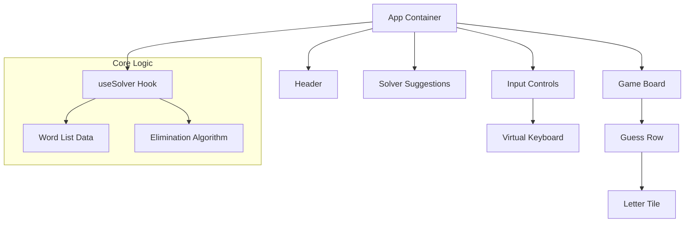

# Architecture - Wordle Solver

## 1. System Overview
The application is a client-side Single Page Application (SPA) built with React. It relies on a static list of words logic executed entirely in the browser.

## 2. Component Architecture

## 3. Module Description

### 3.1 Components
- **App**: Manages the global layout.
- **GameBoard**: Displays the grid of user guesses.
- **Row/Tile**: Renders individual words and colored letters.
- **SolverSuggestions**: Displays the list of calculated best next moves.
- **InputControls**: Handles user text input and color toggling.

### 3.2 State Management (`useSolver` Hook)
The core state resides in a custom React Hook.
- **State**:
    - `guesses`: List of past guesses and their feedback.
    - `candidates`: List of currently possible solution words.
- **Actions**:
    - `addGuess(word, feedback)`: Updates state and triggers re-calculation.
    - `resetGame()`: Clears state.

### 3.3 Solver Algorithm
- **`filterWords(candidates, guess, feedback)`**: Returns a new list of candidates that satisfy the constraints.
- **`scoreWords(candidates)`**: Assigns a score to potential guesses based on how well they split the remaining candidate set (Entropy or Minimax). *MVP: Simple frequency or elimination count.*

## 4. Data Flow
1. User enters a word -> `GuiState` (Draft)
2. User colors the letters -> `GuiState` (Draft)
3. User submits guess -> `useSolver.addGuess`
4. `useSolver` runs `filterWords` -> Updates `candidates`
5. `SuggestionList` re-renders with new best words.
